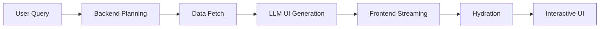
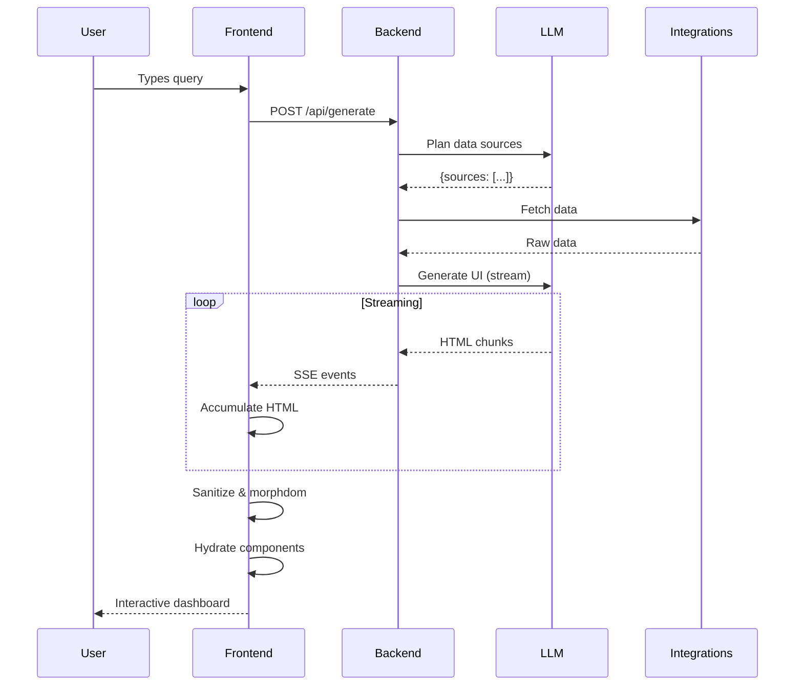
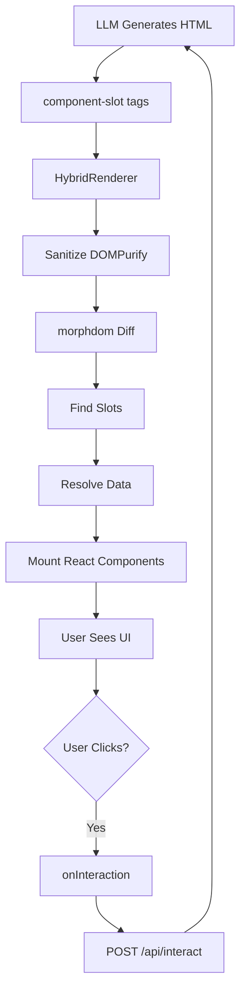
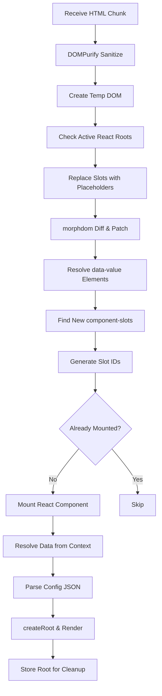
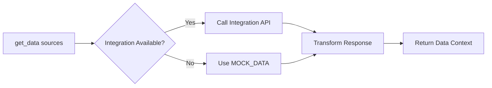
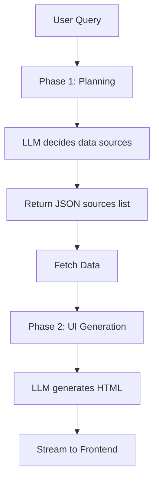
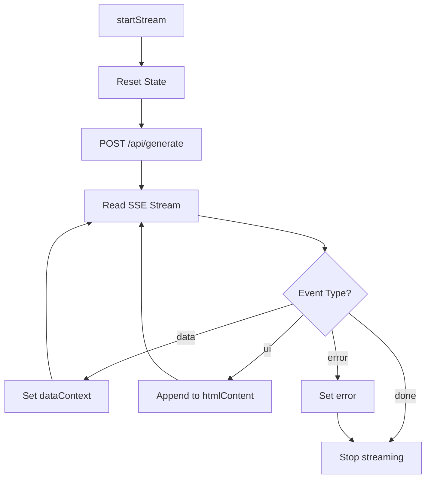
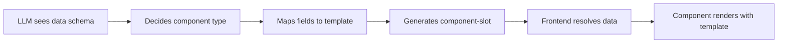

# System Documentation

## Overview

Interactive generative UI system where Claude/GPT streams HTML containing custom `<component-slot>` elements that get hydrated into React components. Real-world data from integrations (Spotify, Strava, Clash Royale, Sports) is fetched and embedded into generated UIs.

## Architecture Flow



### Complete Request Flow



### 1. Query Flow

**Frontend (`/app/generate/page.tsx`)**:
```typescript
startStream(query) → POST /api/generate
```

**Backend (`/backend/main.py`)**:
```python
1. plan_and_classify(query) → determines data sources + intent
2. get_data(sources) → extracts needed data from MOCK_DATA or integrations
3. acompletion(stream=True) → LLM generates HTML with component-slots
4. SSE stream → sends data context + UI chunks to frontend
```

### 2. SSE Event Types

| Event | Data | Purpose |
|-------|------|---------|
| `data` | `{namespace: {key: value}}` | Send data context to frontend |
| `ui` | `{content: "html chunk"}` | Stream HTML incrementally |
| `done` | `{}` | Signal completion |
| `error` | `{message: "error"}` | Report errors |

### 3. Data Context Structure

```typescript
DataContext = {
  [namespace: string]: {
    [key: string]: ComponentData | string | number
  }
}
```

**Example:**
```typescript
{
  "music": {
    "top_songs": [{title, artist, plays}],
    "total_minutes": 87234,
    "top_genres": ["Pop", "Electronic"]
  },
  "fitness": {
    "workouts": 127,
    "by_type": [{type, count, calories}]
  }
}
```

## Component System

### Component Architecture



### Component Slot Syntax

```html
<component-slot 
  type="List"
  data-source="music::top_songs"
  config='{"template": {"primary": "title", "secondary": "artist"}}'
  interaction="smart"
></component-slot>
```

### Available Components

| Component | Data Type | Config | Use Case |
|-----------|-----------|--------|----------|
| **List** | `Array<object>` | `template: {primary, secondary, tertiary, image, link, badge}` | Song lists, activity feeds |
| **Card** | `number \| object` | `template: {value, title, subtitle, icon, trend}` | Metrics, stats |
| **Chart** | `Array<object>` | `template: {x, y}, type: bar\|line\|pie` | Visualizations |
| **Grid** | `Array<object>` | `template: {image, title, subtitle}, columns: number` | Photo galleries |
| **Timeline** | `Array<object>` | `template: {date, title, description, image}` | Event history |

### Data Reference Syntax

**Single Values**:
```html
<data-value data-source="music::total_minutes"></data-value>
```

**Components**:
```html
data-source="namespace::key"
```

## Frontend Rendering

### HybridRenderer Process



**Key Implementation (`HybridRenderer.tsx`)**:

1. **Sanitize**: DOMPurify allows `<component-slot>` and `<data-value>` tags with `data-source` attribute
2. **Parse**: Create temp DOM with new HTML
3. **Active Root Check**: Only replace `<component-slot>` with placeholders if there's an active React root (not just a DOM wrapper)
4. **morphdom Diff**: Efficiently patch DOM, preserving existing React roots
5. **Data Value Resolution**: Set `textContent` of `<data-value data-source="namespace::key">` elements
6. **Hydrate Slots**: Mount React components into new `<component-slot>` elements using `mountedSlotsRef` to track

### Fresh Render Detection

The HybridRenderer distinguishes between streaming appends and fresh renders:

```typescript
// Detect fresh render vs streaming append
const isStreaming = htmlContent.startsWith(prevHtmlRef.current) &&
                    htmlContent.length > prevHtmlRef.current.length;

if (prevHtmlRef.current && !isStreaming) {
  // Content replaced entirely - clear old state
  cleanupRoots();
}
```

This ensures clicking "Load Instantly" or "Simulate Stream" multiple times properly clears previous components.

### Slot ID Generation

```typescript
generateSlotId(slot) => "type::dataSource"
// Example: "List::music::top_songs"
```

Used to track which components are already mounted so morphdom can skip them.

### Key Features

- **Streaming-Optimized**: morphdom patches incrementally without destroying existing components
- **React Preservation**: Placeholder strategy keeps mounted React components alive
- **Efficient Diffing**: Only new/changed DOM elements are updated
- **Error Boundaries**: Per-component error handling prevents cascade failures

## Backend Architecture

### Integration Flow



### Configuration (`config.py`)

```python
Settings:
  - model: "gpt-4o" (LiteLLM)
  - anthropic_api_key, openai_api_key
  - Integration credentials (spotify, strava, clash, sports)
```

### Available Integrations

#### 1. Spotify (`/integrations/spotify.py`)

**OAuth Flow**:
```mermaid
graph LR
A[/api/spotify/auth] --> B[Redirect to Spotify]
B --> C[User Authorizes]
C --> D[/api/spotify/callback]
D --> E[Cache Token]
E --> F[Return Success]
```

**Endpoints**:
- `GET /api/spotify/status` - Check auth
- `GET /api/spotify/data` - Fetch top songs, genres, artists
- `POST /api/spotify/refresh` - Refresh data

**Data Schema**:
```python
{
  "top_songs": [{title, artist, album, popularity}],
  "top_genres": ["Pop", "Electronic"],
  "top_artists": [{name, genres, popularity}],
  "total_minutes": int
}
```

#### 2. Strava (`/integrations/strava.py`)

**Auth**: Uses refresh token from env

**Endpoints**:
- `GET /api/strava/summary` - Athlete stats
- `GET /api/strava/activities?limit=10` - Recent activities

**Data Schema**:
```python
{
  "athlete": {name, city, country},
  "stats": {distance_km, moving_time_hours, elevation_gain_m},
  "activities": [{name, type, distance, moving_time, date}]
}
```

#### 3. Clash Royale (`/integrations/clashroyale.py`)

**Endpoints**:
- `GET /api/clash/player/{tag}` - Full player data
- `GET /api/clash/summary/{tag}` - Formatted summary

**Data Schema**:
```python
{
  "name": str,
  "trophies": int,
  "wins": int,
  "losses": int,
  "cards": [{name, level, max_level, icon_url}],
  "favorite_card": {name, level}
}
```

#### 4. Sports (`/integrations/sports.py`)

**Endpoints**:
- `GET /api/sports/team/{id}` - Team stats
- `GET /api/sports/summary?teams=...` - Multi-team summary

**Data Schema**:
```python
{
  "teams": [{name, sport, league, wins, losses}],
  "total_wins": int,
  "best_team": {name, win_rate}
}
```

#### 5. Stocks (`/integrations/stocks.py`)

**Uses**: Yahoo Finance (Alpha Vantage backup)

**Endpoints**:
- `GET /api/stocks/portfolio?symbols=AAPL,MSFT`

**Data Schema**:
```python
{
  "stocks": [{symbol, price, change, change_percent}],
  "total_value": float
}
```

## LLM System

### Two-Phase Generation



### Phase 1: Planning (`prompts.py`)

```python
build_planning_prompt(query)
→ Returns: {"sources": [...], "intent": "...", "approach": "..."}
```

Determines which data sources to use and UI strategy.

### Phase 2: UI Generation

```python
build_ui_system_prompt(intent, approach)
```

**Key Instructions**:
- Output raw HTML only (no markdown, code blocks)
- Use `<data-value>` for single values
- Use `<component-slot>` for structured data
- Tailwind CSS, dark theme (bg-zinc-950)
- Creative layouts (asymmetry, varying scales, bold choices)
- NO generic dashboards, equal grids, placeholder data

**Constraints**:
- No emojis
- No fake images/numbers
- No lorem ipsum
- Must use entire data context creatively

## Frontend State Management

### Zustand Store (`stores/stream.ts`)

```typescript
interface StreamState {
  isStreaming: boolean;
  dataContext: DataContext;
  htmlContent: string;
  rawResponse: string;
  error: string | null;
  
  startStream: (query: string) => void;
  reset: () => void;
}
```

### Streaming Logic



## Mock Data (`data.py`)

```python
MOCK_DATA = {
  "music": {top_songs, total_minutes, top_genres},
  "travel": {cities, total_countries},
  "fitness": {workouts, total_minutes, by_type},
  "reading": {books_read, total_pages, top_books}
}
```

Used when integrations aren't available. Backend's `get_data(sources)` extracts requested `namespace::key` pairs.

## Component Template System

### Generic Component Pattern



**Example**:
```html
<!-- LLM generates -->
<component-slot 
  type="List"
  data-source="music::top_songs"
  config='{
    "template": {
      "primary": "title",
      "secondary": "artist",
      "image": "album_art"
    }
  }'
/>

<!-- Component renders -->
{data.map(item => (
  <div>
    
    <div>{item[template.primary]}</div>
    <div>{item[template.secondary]}</div>
  </div>
))}
```

## Key Design Decisions

### Why morphdom?

Allows streaming HTML updates without destroying existing React components. Placeholder strategy ensures mounted components are preserved during DOM diffing.

### Why Custom Elements?

`<component-slot>` and `<data-value>` provide clean separation between static HTML (LLM-generated) and dynamic components (React-managed).

### Why Two-Phase LLM?

1. **Planning**: Small, fast, structured → determines data needs
2. **Generation**: Large, creative → produces full UI

Reduces latency and improves data relevance.

### Why SSE?

Enables progressive UI rendering as LLM generates tokens, creating smooth streaming UX.

### Why Generic Components with Templates?

Avoids creating custom components per API response. One `List` component works for songs, books, cities, activities - LLM just maps field names.

## Editing Support

### Refine Endpoint (`/api/refine`)

Allows editing an existing UI based on user feedback:

```python
class RefineRequest(BaseModel):
    query: str          # The refinement instruction
    currentHtml: str    # Existing HTML to modify
    dataContext: dict   # Same data context
```

The LLM receives the current HTML and modifies it based on the refinement request, maintaining the same data context and component structure.

### morphdom Edit Behavior

When edited HTML streams in, morphdom efficiently diffs the changes:

- **Preserved**: Existing React components with same slot IDs
- **Updated**: Static HTML (text, classes, structure)
- **Remounted**: Components with changed `data-source` or `type`

This enables smooth edit transitions without full page re-renders.

## Limitations

- **Slot ID Collisions**: Two components with same `type::dataSource` share ID
- **Mock Data Fallback**: No seamless integration → mock data switching
- **Single Session**: No persistence, undo/redo, or history
- **No Animation Control**: Placeholder components have hardcoded animation logic

Do we want multiple windows